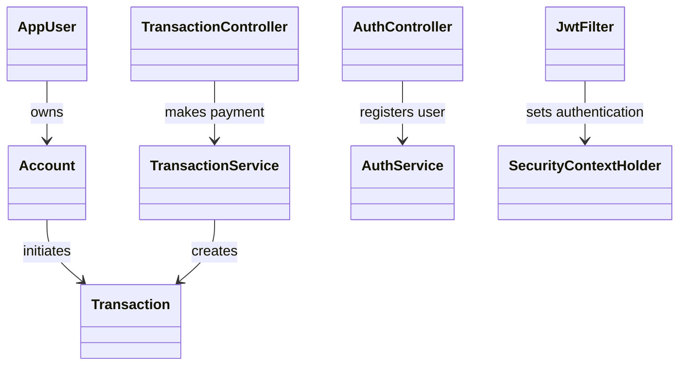

# UPI Clone Backend

A Spring Boot-based backend application simulating UPI payment system with JWT authentication, user registration, and transaction processing.

---

## Table of Contents

1. [Project Overview](#project-overview)
2. [Tech Stack](#tech-stack)
3. [Setup Instructions](#setup-instructions)
4. [API Endpoints](#api-endpoints)
5. [Request & Response Examples](#request--response-examples)
6. [Low-Level Design](#low-level-design)
7. [Follow Diagram](#follow-diagram)

---

## Project Overview

This project allows users to:

* Register and create UPI accounts
* Login with JWT-based authentication
* Make transactions using virtual payment addresses (VPA)
* Ensure secure payments and account management

---

## Tech Stack

* **Language:** Java 17
* **Framework:** Spring Boot 3
* **Database:** PostgreSQL
* **Security:** Spring Security + JWT
* **Build Tool:** Maven
* **Others:** Lombok, JPA/Hibernate, Validation

---

## Setup Instructions

1. Clone the repository:

```bash
git clone <repo_url>
cd upi-clone
```

2. Configure PostgreSQL in `application.properties`:

```properties
spring.datasource.url=jdbc:postgresql://localhost:5432/upi_clone
spring.datasource.username=postgres
spring.datasource.password=<password>
spring.jpa.hibernate.ddl-auto=update
jwt.secret=yourSecretKey
jwt.expirationMs=3600000
```

3. Build and run the project:

```bash
mvn clean install
mvn spring-boot:run
```

4. Test APIs using Postman or any REST client.

---

## API Endpoints

### Auth

* **Register User**
  `POST /api/auth/register`
* **Login**
  `POST /api/auth/login`

### Transactions

* **Make Payment**
  `POST /api/transactions/pay`  (Protected, JWT required)

---

## Request & Response Examples

### Register User

**Request:**

```json
{
  "name": "Karan",
  "mobile": "9876543211",
  "password": "password123",
  "requestedVpa": "karan",
  "initialBalance": 5000
}
```

**Response:**

```json
{
  "id": 2,
  "name": "Karan",
  "mobile": "9876543211",
  "account": {
    "vpa": "karan@upi",
    "balance": 5000.0,
    "isActive": true
  }
}
```

### Login

**Request (Form Params):**

```
username=9876543211
password=password123
```

**Response:**

```json
{
  "token": "<jwt_token_here>"
}
```

### Make Payment

**Request:**

```json
{
  "fromVpa": "karan@upi",
  "toVpa": "rahul@upi",
  "amount": 1000
}
```

**Response:**

```json
{
  "id": 10,
  "fromVpa": "karan@upi",
  "toVpa": "rahul@upi",
  "amount": 1000,
  "status": "SUCCESS",
  "timestamp": "2025-10-01T23:50:00"
}
```

---

## Low-Level Design

### Classes & Responsibilities

* **AppUser**: Entity representing user details.
* **Account**: Entity representing UPI account and balance.
* **Transaction**: Entity representing payment transactions.
* **AuthService**: Handles user registration.
* **TransactionService**: Handles payment processing.
* **JwtUtil**: Generates and validates JWT tokens.
* **AuthController**: Handles authentication endpoints.
* **TransactionController**: Handles transaction endpoints.
* **SecurityConfig**: Spring Security configuration.
* **JwtFilter**: Filters requests to validate JWT.

### Sequence Flow for Payment

1. User sends payment request with JWT.
2. `JwtFilter` validates token.
3. `TransactionController` forwards request to `TransactionService`.
4. `TransactionService` validates accounts & balance.
5. Deducts from sender and credits receiver.
6. Transaction saved in DB and returned.

---

## Follow Diagram



License

This project is open-source and free to use for learning and development purposes.
